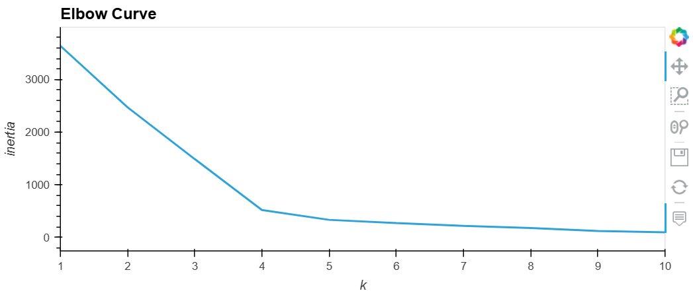
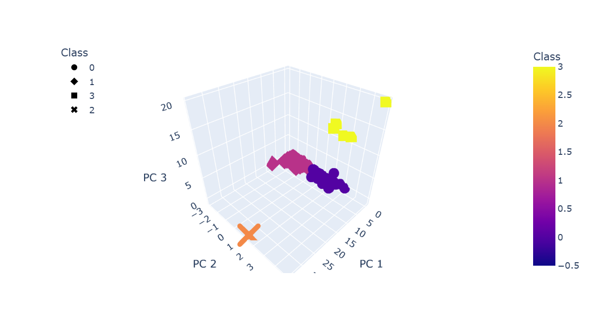
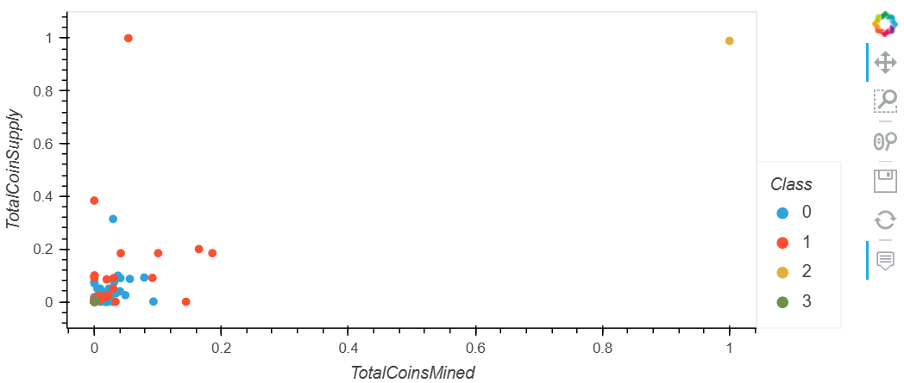

# Cryptocurrency Clustering Analysis | Unsupervised Machine Learning

**Christopher Madden** | [LinkedIn](http://bit.ly/4uMMPV7) | [GitHub Portfolio](https://bit.ly/3Pz5LS3)

---

## Project Overview

This project applies unsupervised machine learning to classify and cluster tradable cryptocurrencies based on their features, using K-means clustering and Principal Component Analysis (PCA). Because there is no predefined label to predict, the goal is to discover natural groupings within the data that could inform investment portfolio segmentation or market categorization.

The analysis follows a complete unsupervised ML pipeline: data preprocessing, dimensionality reduction, optimal cluster selection, model fitting, and results visualization.

This is a portfolio project completed as part of my Data Analytics Certificate program at Case Western Reserve University (2022).

---

## Tools & Skills Demonstrated

- **Language:** Python
- **Libraries:** scikit-learn, Pandas, Plotly, hvPlot
- **Environment:** Jupyter Notebook
- **Techniques:** PCA, K-means clustering, elbow curve analysis, StandardScaler normalization, categorical encoding
- **Competencies:** Unsupervised learning, dimensionality reduction, cluster visualization, data preprocessing

---

## Dataset

- **Source:** `crypto_data.csv` — cryptocurrency market data including algorithm, proof type, total coins mined, and total coin supply
- **Preprocessing:** Removed non-tradable currencies, dropped null values, encoded categorical variables, and scaled all features before modeling

---

## Analysis Pipeline

### Step 1 — Preprocessing the Data for PCA
- Filtered dataset to only include currently tradable cryptocurrencies
- Removed rows with missing values
- Encoded categorical columns (`Algorithm`, `ProofType`) using `get_dummies()`
- Scaled all features using `StandardScaler` to normalize for PCA

### Step 2 — Reducing Dimensions Using PCA
- Applied PCA to reduce the feature space to 3 principal components
- Retained enough variance to support meaningful clustering while reducing computational complexity

### Step 3 — Clustering with K-means
- Used the elbow curve method to determine the optimal number of clusters (k=4)
  
  
- Fit the K-means model and assigned cluster labels to each cryptocurrency

### Step 4 — Visualizing Results
- Built a 3D scatter plot using Plotly to visualize the four cryptocurrency clusters across the three PCA components
  
- Built a 2D scatter plot comparing total coins mined vs. total coin supply, colored by cluster assignment
  


---

## Key Takeaways

- PCA effectively reduced a high-dimensional dataset while preserving enough structure for meaningful K-means clustering
- The elbow curve identified k=4 as the optimal cluster count — a non-obvious result that required data-driven validation rather than assumption
- Unsupervised methods are well-suited to cryptocurrency data where labels (e.g., "good investment") don't exist and pattern discovery is the goal

---

## Repository Structure

```
Cryptocurrencies/
├── crypto_clustering.ipynb     # Full analysis notebook
├── crypto_data.csv             # Source dataset
└── README.md
```

---

## About the Author

I am a Data Analyst with experience in SQL, Python, R, Power BI, Tableau, and Excel. I specialize in data cleaning, statistical analysis, dashboard development, and translating complex data into clear business insights.

📧 maddenc33@gmail.com | [LinkedIn](http://bit.ly/4uMMPV7) | [GitHub](https://bit.ly/3Pz5LS3)
